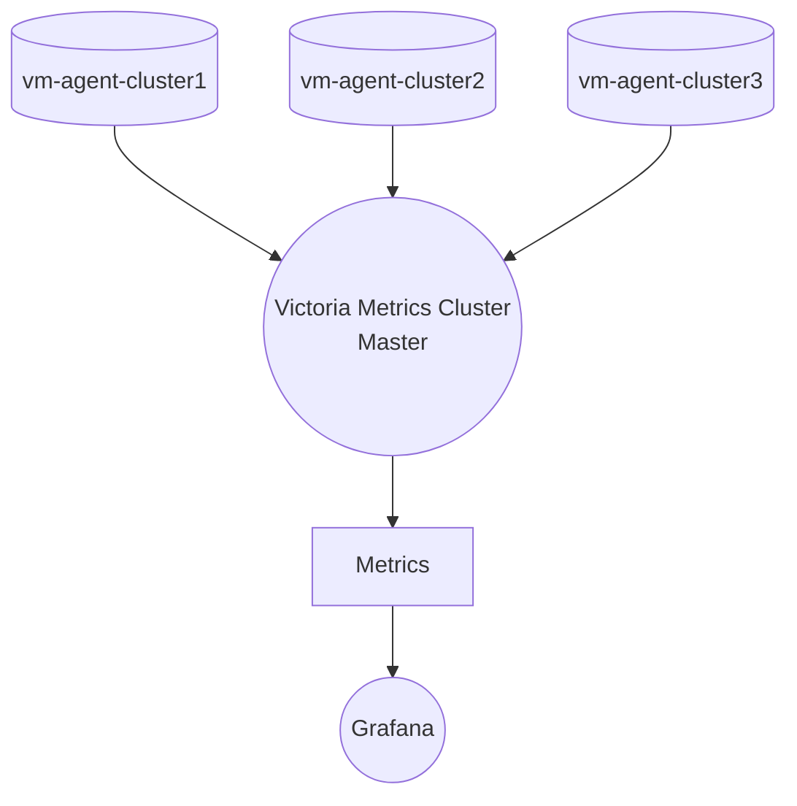

# Multi-Cluster-Monitoring
Multi cluster monitoring using Grafana, Victoria Metrics in GCP
```
Infra
- Cloud: GCP
- Global VPC: GCP
- GKE: 1.28
- Nginx Ingress
- Victoria Metrics Cluster HA
- Grafana HA with Database as backend
- Kustomization + Helm
- Blackbox Exporter to check API health
```


